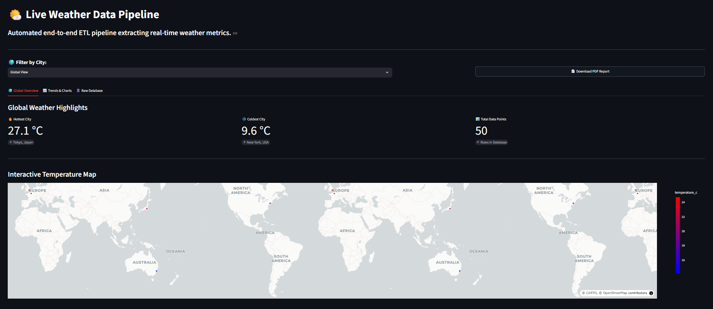

# ⛅ Automated Weather ETL Pipeline & Dashboard

An end-to-end data engineering portfolio project that automatically extracts live weather data for global cities, stores it in a serverless cloud PostgreSQL database, and visualizes it via a highly interactive web dashboard.



## 🚀 Live Application
[View the Live Streamlit Dashboard Here](https://automated-weather-etl-pipeline-firdauslani.streamlit.app/)

## 🛠️ Architecture & Tech Stack
* **Data Source:** Open-Meteo API (Live temperature and wind speed)
* **Extract & Transform:** Python (Pandas, Requests)
* **Load & Storage:** Neon Cloud PostgreSQL (Serverless Database)
* **Automation:** GitHub Actions (CI/CD Cron Scheduler)
* **Data Visualization:** Streamlit Community Cloud & Plotly Express

## 📊 Key Features
* **Automated ETL Pipeline:** A Python script scheduled via GitHub Actions to fetch, transform, and load new data automatically.
* **Modern Tabbed UI:** A wide-layout interface featuring custom CSS for emphasized KPIs and seamless tabbed navigation between overviews, trends, and raw data.
* **Interactive Mapping:** Visualizes the latest global temperatures using Plotly's `scatter_map` with dynamic hover tooltips.
* **Automated PDF Reporting:** Integrates `fpdf2` to generate on-the-fly, cleanly formatted, downloadable PDF business reports.
* **Timezone Management:** Raw data is robustly stored in UTC and dynamically transformed to local time (MYT) strictly for UI presentation.
* **Stateless Cloud Deployment:** Uses pre-compiled `psycopg-binary` drivers and strict environment variables to ensure the app runs flawlessly on cloud servers.

## 💻 Local Setup & Development
To run this project locally, ensure you have Python installed, then follow these steps:

1. Clone the repository:
   ```bash
   git clone [https://github.com/firdauslani03/Automated-Weather-ETL-Pipeline](https://github.com/firdauslani03/Automated-Weather-ETL-Pipeline)
   cd your-repo-name